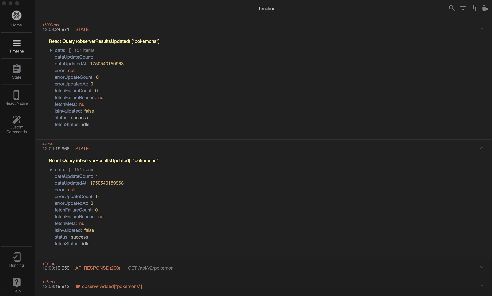

# Reactotron React Query for React Native



Is there a plugin for Reactotron that allows for similar functionality to the React Query Devtools? Yes! This plugin helps you debug your React Query cache and queries in Reactotron.

## Installation

```bash
npm i @tanstack/react-query
npm i reactotron-react-native --save-dev
npm i reactotron-react-query --save-dev
```

## Usage

Create a file queryClient.ts

```typescript
import { QueryClient } from '@tanstack/react-query';
const queryClient = new QueryClient();

export { queryClient };
```

Create a file reactotron.ts

```typescript
import Reactotron from 'reactotron-react-native';
import {
  QueryClientManager,
  reactotronReactQuery,
} from 'reactotron-react-query';
import { queryClient } from './queryClient';

const queryClientManager = new QueryClientManager({
  // @ts-ignore
  queryClient,
});

Reactotron.use(reactotronReactQuery(queryClientManager))
  .configure({
    onDisconnect: () => {
      queryClientManager.unsubscribe();
    },
  })
  .useReactNative()
  .connect();
```

Import the queryClient and reactotron in your App.jsx file.

```jsx
import { StyleSheet, Text, View } from 'react-native';
import { QueryClientProvider } from 'react-query';
import { queryClient } from './queryClient';

if (__DEV__) {
  require('./reactotron.ts');
}

export default function App() {
  return (
    <QueryClientProvider client={queryClient}>
      <View style={styles.container}>
        <Text>Open up App.js to start working on your app!</Text>
      </View>
    </QueryClientProvider>
  );
}

const styles = StyleSheet.create({
  container: {
    flex: 1,
    backgroundColor: '#fff',
    alignItems: 'center',
    justifyContent: 'center',
  },
});
```

### How to invalidate queries

If you want to invalidate a query, you can use custom commands.


